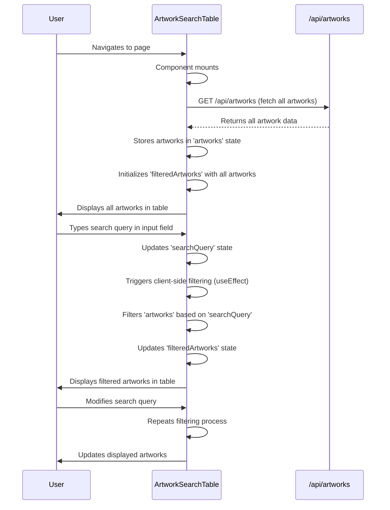

# ArtworkSearchTable Component Explanation

This document explains the `ArtworkSearchTable` React component, which provides client-side search functionality for artworks.

## 1. Component Overview

The `ArtworkSearchTable` component is a React functional component that fetches artwork data from the `/api/artworks` endpoint and allows users to search and filter this data directly in the browser. Unlike previous server-side search implementations, this component fetches all data once and performs filtering on the client side.

## 2. Features

- **Client-Side Search**: All artworks are fetched initially, and subsequent search queries filter the displayed data without making new API requests.
- **Dynamic Filtering**: Users can type into a search box, and the table updates in real-time to show only matching artworks.
- **Case-Insensitive Search**: The search functionality is case-insensitive, providing a more user-friendly experience.
- **Multi-Column Search**: The search query is applied across multiple relevant columns (e.g., `artist`, `medium1`, `medium2`, `title`, `year`).
- **Loading and Error States**: The component handles and displays loading and error states during the initial data fetch.

## 3. How it Works

1.  **Data Fetching**: When the component mounts, it uses `useEffect` to fetch all artwork data from the `/api/artworks` endpoint. The `useState` hook manages the `artworks` (all fetched data), `filteredArtworks` (data displayed in the table), `loading`, and `error` states.
2.  **Search Input**: An input field allows users to type their search query. The `handleSearch` function updates the `searchQuery` state as the user types.
3.  **Client-Side Filtering**: Another `useEffect` hook triggers whenever the `searchQuery` or `artworks` state changes. It filters the `artworks` array based on the `searchQuery`. The filtering logic checks if the search query (converted to lowercase) is present in the `artist`, `medium1`, `medium2`, `title`, or `year` fields of each artwork (also converted to lowercase).
4.  **Display**: The `filteredArtworks` array is then mapped to display the results in an HTML table.

## 4. Key Differences from Previous Implementations

-   **Search Location**: Previous implementations (e.g., using `/api/search`) performed search operations on the server. This component shifts the search logic entirely to the client-side after an initial full data fetch.
-   **API Calls**: Only one API call (`/api/artworks`) is made when the component loads. Subsequent searches do not trigger new API requests, reducing server load and improving responsiveness for the user.
-   **Data Volume**: This approach is suitable for datasets that are not excessively large, as all data needs to be loaded into the client's memory.

## 5. Data Flow and Interactions (Mermaid Sequence Diagram)

This diagram illustrates how the `ArtworkSearchTable` component fetches all artwork data once from the `/api/artworks` endpoint and then performs subsequent filtering operations directly within the browser based on the user's search input.