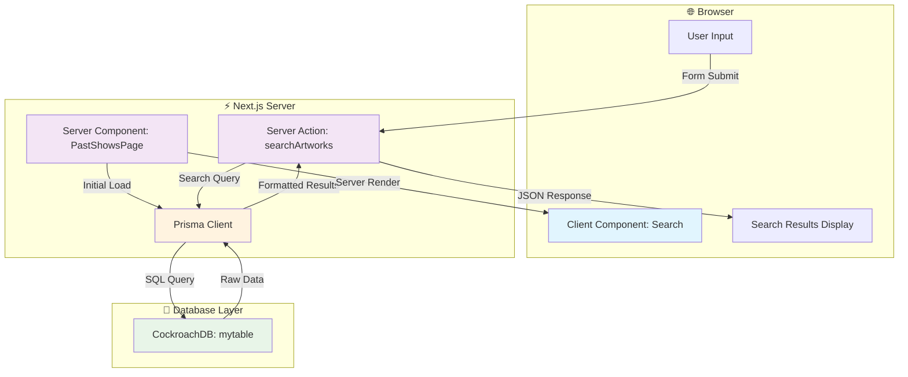
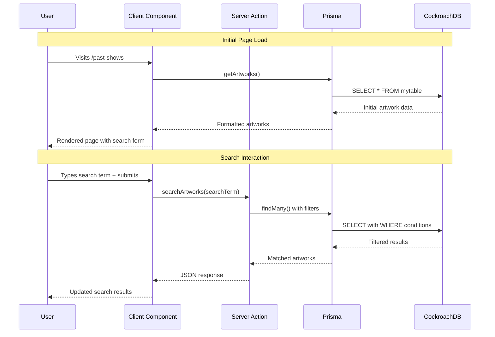

# Optimized Data Flow with Next.js App Router

This document outlines a modernized data flow for the application, leveraging the Next.js App Router, Server Components, and Server Actions to create a more performant and maintainable architecture.

## 1. Project Structure with App Router

Migrating from the `pages` directory to the `app` directory enables powerful features like nested layouts and server-first data fetching.

- **`app/`**: The new root for routing
- **`app/layout.js`**: The root layout for the entire application
- **`app/past-shows/page.js`**: The main page component for past shows, now a Server Component
- **`app/components/`**: Reusable components, which can be Server or Client Components

## 2. Data Fetching with Server Components

With the App Router, we can fetch data directly within our components on the server, simplifying the architecture significantly.

### Server Component Implementation

**File: `app/past-shows/page.js`**

```js
// app/past-shows/page.js
import { prisma } from '../../prisma/globalprisma';
import Search from '../components/Search';

async function getArtworks() {
  const artworks = await prisma.mytable.findMany();
  return artworks.map(artwork => ({ 
    ...artwork, 
    id: artwork.id.toString() 
  }));
}

export default async function PastShowsPage() {
  const initialArtworks = await getArtworks();
  
  return (
    <div>
      <h1>Past Shows</h1>
      <Search />
    </div>
  );
}
```

## 3. Server Actions for Interactive Search

**File: `app/actions.js`**

```js
'use server';

import { prisma } from '../prisma/globalprisma';

export async function searchArtworks(searchTerm) {
  if (!searchTerm || searchTerm.trim() === '') {
    return [];
  }
  
  const artworks = await prisma.mytable.findMany({
    where: {
      OR: [
        { artist: { contains: searchTerm, mode: 'insensitive' } },
        { medium1: { contains: searchTerm, mode: 'insensitive' } },
        { medium2: { contains: searchTerm, mode: 'insensitive' } },
      ],
    },
  });
  
  return artworks.map(artwork => ({ 
    ...artwork, 
    id: artwork.id.toString() 
  }));
}
```

## 4. Client Component for Search Interface

**File: `app/components/Search.js`**

```js
'use client';

import { useState } from 'react';
import { searchArtworks } from '../actions';

export default function Search() {
  const [results, setResults] = useState([]);
  const [search, setSearch] = useState('');
  
  const handleSearch = async (e) => {
    e.preventDefault();
    const searchResult = await searchArtworks(search);
    setResults(searchResult);
  };
  
  return (
    <div>
      <form onSubmit={handleSearch}>
        <input 
          value={search}
          onChange={(e) => setSearch(e.target.value)}
          placeholder="Search by artist or medium..."
        />
        <button type="submit">Search</button>
      </form>
      
      <ul>
        {results.map((result) => (
          <li key={result.id}>
            <strong>{result.artist}</strong> - {result.medium1}
          </li>
        ))}
      </ul>
    </div>
  );
}
```

## 5. Data Flow Architecture



## 6. Request Flow Sequence



## 7. Performance Benefits

| Aspect | Traditional SPA | Next.js App Router |
|--------|----------------|-------------------|
| **Initial Load** | Client-side data fetching | Server-rendered with data |
| **Search Response** | Full page JavaScript | Server Action response |
| **Bundle Size** | Large client bundle | Optimized server/client split |
| **SEO** | Limited crawlability | Full server-side rendering |
| **Caching** | Browser-only | Server + CDN + Browser |

## 8. Implementation Checklist

- [ ] Migrate from `pages/` to `app/` directory structure
- [ ] Convert page components to async Server Components
- [ ] Extract data fetching logic into Server Actions
- [ ] Mark interactive components with `'use client'`
- [ ] Update import paths for new directory structure
- [ ] Test server actions with form submissions
- [ ] Verify Prisma client works in server context
- [ ] Implement error boundaries for client components