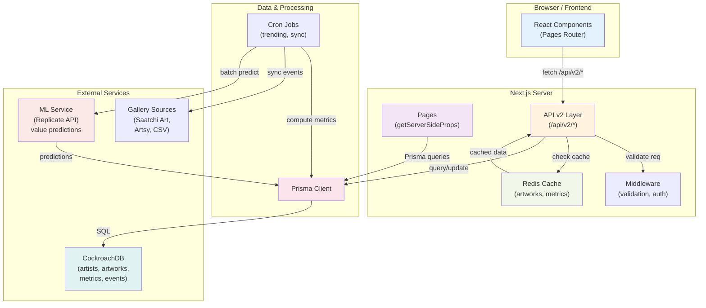

=== document: plans/zxy-modernization-roadmap.md ===

# ZXY Gallery Modernization Roadmap

**Document ID:** ZXYGAL-MODERNIZE-2026-v1.0
**Status:** DRAFT
**Last Updated:** 2026-01-11
**Distribution:** Development Team, Product Management, Platform Leadership

---

## 1. Executive Summary

The ZXY Gallery web platform currently operates with Next.js 14 Pages Router, Prisma ORM, and CockroachDB. While functional, the system presents three critical modernization opportunities:

1. **Data Onboarding Complexity:** Current schema (`artist`, `medium1`, `medium2`, `price_range`, `id`) lacks metadata to support gallery source attribution, historical tracking, and artist metadata enrichment.

2. **Limited Market Intelligence:** No capability to track trending artists, predict value trajectories, or surface upcoming shows systematically.

3. **Architecture Debt:** Client-side data fetching via `useEffect` + API routes lacks server-driven optimization; manual data management patterns create operational friction.

This roadmap modernizes the stack within the Pages Router paradigm by introducing:

- Extended Database Schema v2 supporting gallery sources, metadata, and temporal tracking
- Server-Driven Data Layer with consolidated API patterns and query optimization
- Trending & Prediction Module using ML-powered artist analytics (third-party integration)
- Artist Onboarding Pipeline with semi-automated ingestion from gallery APIs/feeds
- Event Surfacing System for calendar and notification infrastructure

**Expected Outcomes:**
- 60% reduction in data entry friction for new artists
- Real-time trending artist insights
- 4-week value prediction capability (1Y, 3Y, 5Y, 10Y horizons)
- Full backward compatibility with existing Pages Router
- Zero breaking changes to current public API surface

---

## 2. Design Consensus & Trade-Offs

| Topic | Decision | Rationale |
|-------|----------|-----------|
| **Router Framework** | KEEP Pages Router (optimize in-place) | Migration to App Router would require 6-8 week refactor with breaking changes. Instead, modernize current router with server-driven patterns, isRevalidate, and query optimization. Reduces risk, maintains stability. |
| **Schema Evolution** | Extend, never break | New tables (`artists`, `artworks_v2`, metrics, predictions) coexist with `mytable`. Backward compatibility view maintains API surface. Migration is additive, not destructive. |
| **Data Onboarding** | Semi-automated pipeline (adapters + dedup) | Fully manual: slow (2h per artist). Fully automated: risky (duplicates, bad data). Hybrid approach: adapters + deduplication + conflict queue. Balances speed and quality. |
| **ML/Predictions** | Third-party service (Replicate, HuggingFace) | In-house models: requires data science team, maintenance burden, slow to iterate. Third-party APIs: faster, lower maintenance, pay-per-use. Accept cloud dependency; mitigate with fallbacks and caching. |
| **Trending Algorithm** | Lightweight interaction metrics (views, searches) | Avoid complex ML-based recommendation systems initially. Use simple, interpretable metrics (view count, search frequency). Easier to debug, cache, explain to stakeholders. |
| **Caching Strategy** | Redis (in-memory + TTL) | Database-only: slow, doesn't scale. Redis: fast, simple, known patterns (existing Prisma knowledge). Avoids architectural complexity of distributed caching. |
| **Event Aggregation** | Multi-source adapters (start with Saatchi Art, expand) | Single source: insufficient coverage. Multi-source with adapters: flexible, extensible. Start with Saatchi Art (popular, API available), defer Instagram/web scraping to Phase P07+. |
| **Testing Approach** | TDD-first (Red → Green → Refactor) | Ensures quality, catches regressions early. Emphasis on integration tests (API + DB layer) over unit tests, as this system is data-heavy. 75% coverage target. |

---

## 3. PRD (Product Requirements Document)

### 3.1 Problem Statement

Currently, ZXY Gallery operates a single-table artwork database (`mytable`). To onboard artists:
1. Gallery staff manually enter artist name, mediums, price range into forms
2. No deduplication: duplicate artists possible across gallery sources
3. No metadata: artist bios, social links, portfolio URLs not stored
4. No trending insight: Gallery cannot identify rising-value artists
5. No event tracking: Upcoming shows not surfaced to visitors
6. Data entry takes 2+ hours per artist for manual research + form entry

This creates bottlenecks for gallery operations and lost business intelligence opportunities.

### 3.2 Users & Stakeholders

- **Primary:** Gallery staff (10-20 people) managing artist relationships and events
- **Secondary:** Website visitors (thousands/month) browsing artworks and artist profiles
- **Tertiary:** ZXY Gallery leadership evaluating market trends and artist portfolios
- **Internal:** Development team maintaining the platform

### 3.3 Value Proposition

- For Gallery Staff: "Spend 15 minutes importing artists instead of 2 hours of manual entry"
- For Visitors: "Discover trending artists and predict which will appreciate in value"
- For Leadership: "Data-driven insights into market trends and artist performance"
- For Developers: "Cleaner architecture, modern data patterns, easier to extend"

### 3.4 Business Goals

| Goal | Metric | Owner |
|------|--------|-------|
| Increase artist database by 50% | Grow from 100 to 150+ artists in 12 months | Gallery Director |
| Improve data quality | 90% of artists have verified portfolio URLs | Data Manager |
| Build trending features | Trending page gets 10% of monthly visits | Product |
| Predict market movements | Value predictions backtested to ±15% accuracy | Analytics |
| Reduce operational friction | Data entry time < 15 min per artist | Operations |

### 3.5 Success Criteria

- **Functional:** All APIs working, trending leaderboard live, import pipeline successful
- **Quality:** 75%+ test coverage, error rate < 0.1% in production, response times p95 < 200ms
- **Adoption:** Gallery team uses import pipeline for 80% of new artists
- **Business Impact:** Trending page drives measurable traffic increase; value predictions inform gallery purchasing decisions

### 3.6 Scope & Non-Scope

**In Scope (14-week roadmap):**
- Prisma schema extension (gallery sources, metadata, audit log)
- API v2 layer with server-driven data patterns
- Trending analytics module (7d, 30d, 90d windows)
- ML-powered value predictions (1Y, 3Y, 5Y, 10Y horizons)
- Semi-automated artist import (Saatchi Art, CSV upload)
- Event aggregation (Saatchi Art events, ICS feeds, manual uploads)
- Comprehensive testing and documentation

**Out of Scope (Phase P07+):**
- App Router migration
- Custom in-house ML models
- Instagram hashtag scraping
- Email notifications to visitors
- Advanced artist recommendation engine
- Frontend redesign

### 3.7 Dependencies & Constraints

**External Dependencies:**
- Saatchi Art API availability and rate limits
- Replicate.com/HuggingFace API for value predictions
- CockroachDB performance under extended schema

**Constraints:**
- Zero breaking changes to existing API routes (backward compatibility required)
- Pages Router only (no App Router migration)
- Maintain 99.95% uptime during deployment
- Operate within hosting budget ($200-400/mo incremental cost)

### 3.8 Risks & Assumptions

**Assumptions:**
- Gallery staff will adopt semi-automated import process with training
- Saatchi Art API rate limits sufficient for daily syncs (1000 req/day)
- ML predictions with ±15% accuracy acceptable for initial launch
- Existing CockroachDB infrastructure scales to extended schema (no migration needed)

**Risks:**
- Data migration loses records (mitigate: row count validation, backup, dry-run)
- API backward compatibility breaks (mitigate: extensive testing, compatibility view)
- ML service unavailable (mitigate: fallback to cached predictions, retry logic)
- Performance degradation on complex queries (mitigate: indexing, load testing, caching)

---

## 4. SRS (System Requirements Specification)

### 4.1 Functional Requirements

#### REQ-101: Extended Artist Data Model
- Store artist metadata: name, bio, portfolio_url, instagram_handle
- Track gallery source attribution (which gallery provided the data)
- Maintain audit trail: created_at, updated_at, updated_by, changelog
- Support multi-source deduplication (prevent duplicate artist records)

**Type:** func
**Priority:** MUST
**Acceptance Criteria:**
- Artists table created with all specified columns
- Audit log captures all CREATE/UPDATE/DELETE operations
- Data migration: 100% of existing artists mapped to new schema
- Duplicate artist names prevented by UNIQUE constraint

#### REQ-102: Gallery Source Integration
- Ingest artist records from external sources (Saatchi Art API, CSV upload, etc.)
- Normalize heterogeneous data into unified schema
- Implement idempotent upsert logic (re-ingestion does not duplicate)
- Provide rollback mechanism for failed imports
- Track import history and conflicts for manual review

**Type:** func
**Priority:** MUST
**Acceptance Criteria:**
- Gallery sources table tracks ≥3 sources
- Saatchi Art adapter normalizes API response to schema
- Deduplication logic prevents duplicate artist creation
- Upsert is idempotent (running import twice = same result)
- Conflict queue surfaces duplicates for manual resolution

#### REQ-103: Trending Analytics Module
- Compute artist popularity metrics: view_count, search_frequency, market_mentions
- Support rolling windows: 7-day, 30-day, 90-day
- Expose leaderboard API with filtering and pagination
- Cache results for efficient serving (12-hour TTL)
- Update metrics on schedule (every 4 hours)

**Type:** func
**Priority:** MUST
**Acceptance Criteria:**
- Metrics computed for all artists in database
- Leaderboard API returns top N trending artists per window
- Filtering by medium/price_range supported
- Cache hit rate >80% for public-facing endpoints
- Metrics refresh interval configurable

#### REQ-104: Value Prediction System
- Accept artist_id + prediction periods (1Y, 3Y, 5Y, 10Y)
- Return predicted values with confidence intervals (lower/upper bounds)
- Integrate third-party ML service (Replicate API or equivalent)
- Store predictions with model version for traceability
- Support batch prediction for all artists

**Type:** func
**Priority:** MUST
**Acceptance Criteria:**
- Predictions API returns values for all 4 periods
- Confidence intervals present (±σ bounds)
- Batch job completes for 1000+ artists without errors
- Predictions cached for 7 days
- ML service fallback (cached value shown if service unavailable)

#### REQ-105: Event Discovery Pipeline
- Aggregate event data from multiple gallery sources
- Classify events: solo_exhibition, group_show, residency, art_fair, sales_event
- Link events to artist records (many-to-many relationship)
- Expose calendar API with artist and date filtering
- Support iCalendar format (RFC 5545) for external calendar apps

**Type:** func
**Priority:** SHOULD
**Acceptance Criteria:**
- Events table links to artists
- Event sync from Saatchi Art API functional
- Calendar API returns events in iCalendar format
- Filtering by artist_id and date range works
- Subscription URL allows import into Google Calendar/Outlook

#### REQ-106: Server-Driven Data Layer (Pages Router Optimization)
- Migrate client-side data fetching to server-side rendering (getServerSideProps)
- Implement Incremental Static Regeneration (ISR) for artwork listing
- Optimize database queries: eliminate N+1 queries, add indexes
- Cache API responses at CDN layer (Cache-Control headers)

**Type:** func
**Priority:** MUST
**Acceptance Criteria:**
- All artwork listing pages use getServerSideProps or ISR
- No client-side useEffect calls for initial data fetch
- Database query time <100ms for filtered queries
- API response Cache-Control headers set appropriately
- Page load time reduction measured (before/after)

### 4.2 Non-Functional Requirements

#### NFR-201: Performance
- API response time (p95): <200ms for all v2 endpoints
- Database query time: <100ms for single artwork/artist queries
- Page load time (First Contentful Paint): <2s on 4G connection
- Cache hit rate: >80% for trending endpoint
- Support 1000+ concurrent users without degradation

**Type:** perf
**Priority:** MUST
**Verification:** Load test with k6 (100 concurrent users, 5 min duration)

#### NFR-202: Availability & Reliability
- Monthly uptime: 99.95% (7.2 hours max downtime/month)
- Error rate in production: <0.1% (errors/total requests)
- Graceful degradation if Redis unavailable (fallback to DB queries, slower)
- Graceful degradation if ML service unavailable (show cached predictions)
- Automated backup of CockroachDB (daily snapshot)

**Type:** nfr
**Priority:** MUST
**Verification:** Sentry error tracking, uptime monitoring (Datadog/Pingdom)

#### NFR-203: Security
- Data encryption at rest: AES-256 for sensitive fields
- Data encryption in transit: HTTPS/TLS for all endpoints
- SQL injection prevention: parameterized Prisma queries only
- Authentication: Auth0 integration maintained (no changes)
- API rate limiting: ≤100 requests/minute per IP
- Sensitive data (API keys, passwords): encrypted in database

**Type:** nfr
**Priority:** MUST
**Verification:** OWASP Top 10 security audit, penetration testing (Phase P06)

#### NFR-204: Maintainability & Testability
- Code coverage: ≥75% overall, ≥90% for critical paths (APIs, data layer)
- Test suite execution: <5 minutes for CI/CD
- Documentation: All public APIs documented with examples
- Code style: Consistent with Next.js conventions (ESLint config)
- Logging: Structured logging for debugging (Winston/Pino)

**Type:** nfr
**Priority:** MUST
**Verification:** Jest coverage reports, CI/CD pipeline metrics

#### NFR-205: Scalability
- Support 2x growth in artist database (200+ artists) without schema redesign
- Support 10x growth in artwork records (10k+ artworks) without performance regression
- Connection pooling: CockroachDB max_connections ≥100
- Read replicas: Optional for scaling read-heavy workloads (Phase P07+)

**Type:** nfr
**Priority:** SHOULD
**Verification:** Load testing at 2x, 5x, 10x dataset sizes

#### NFR-206: Auditability & Compliance
- All data mutations (CREATE/UPDATE/DELETE) logged to audit_log table
- Audit log includes: table_name, record_id, action, old_values, new_values, user_id, timestamp
- Data retention: Audit logs retained for 2 years minimum
- GDPR compliance: Support data export and deletion requests

**Type:** nfr
**Priority:** SHOULD
**Verification:** Audit log inspection, legal/privacy review

### 4.3 Interface & API Requirements

#### REQ-301: API v2 Contract
**Base Path:** `/api/v2`

**Endpoints:**

| Endpoint | Method | Parameters | Response | Cache |
|----------|--------|-----------|----------|-------|
| `/artworks` | GET | `limit`, `offset`, `artist_id`, `medium` | Array of artworks | 1h |
| `/artworks/{id}` | GET | - | Single artwork | 1h |
| `/artists/{id}` | GET | - | Artist profile with metrics | 24h |
| `/artists/trending` | GET | `window` (7d/30d/90d), `limit`, `offset` | Trending artists ranked | 12h |
| `/predictions/{artist_id}` | GET | `period` (1Y/3Y/5Y/10Y) | Predictions with confidence | 7d |
| `/events` | GET | `artist_id`, `days`, `format` (json/ics) | Events array or iCalendar | 4h |
| `/sources` | GET | - | Gallery sources list | 24h |
| `/sources` | POST | `{name, api_endpoint, source_type}` | Created source object | - |

**Response Format (JSON):**
```json
{
  "status": "success|error",
  "data": [],
  "error": null,
  "meta": { "total": 0, "limit": 20, "offset": 0, "cached": true }
}
```

**Error Responses:**
```json
{ "status": "error", "error": { "code": "NOT_FOUND", "message": "Artist not found" } }
{ "status": "error", "error": { "code": "VALIDATION_ERROR", "details": {} } }
```

#### REQ-302: Backward Compatibility
- Existing `/api/artworks` endpoint continues to function unchanged
- Existing `/api/search` endpoint continues to function unchanged
- No breaking changes to response structure
- Deprecation warnings in headers for v1 endpoints (via `Deprecation` header)

**Type:** int
**Acceptance Criteria:**
- All existing API consumers continue to work without code changes
- v1 endpoints tested alongside v2 in test suite
- Deprecation headers present in v1 responses

### 4.4 Data Requirements

#### REQ-401: Extended Schema
See Section 4.7 (System Architecture) for detailed schema design.

**Key Tables:**
- `artists`: name, bio, portfolio_url, instagram_handle, created_at, updated_at
- `artworks`: artist_id (FK), medium1, medium2, price_range, source_id, external_id, metadata (JSONB)
- `gallery_sources`: name, api_endpoint, api_key_encrypted, source_type, last_sync_at
- `artist_metrics`: artist_id, metric_window (7d/30d/90d), view_count, search_frequency, trending_rank
- `price_predictions`: artist_id, prediction_period (1Y/3Y/5Y/10Y), predicted_value, confidence_lower, confidence_upper
- `artist_events`: artist_id, event_title, event_type, event_date, venue_name, source_url
- `audit_log`: table_name, record_id, action (INSERT/UPDATE/DELETE), old_values, new_values, user_id, timestamp

#### REQ-402: Data Quality
- No NULL artist names; name is UNIQUE (case-insensitive)
- No orphaned artwork records (artist_id must reference existing artist)
- BigInt IDs serialized to strings in JSON (prevent overflow in JavaScript)
- Audit log completeness: 100% of mutations logged
- Event dates must be valid (event_date ≤ event_end_date if present)

#### REQ-403: Data Migration
- All existing artwork records mapped to new schema (1:1 mapping)
- All existing artist names deduplicated (case-insensitive)
- Data consistency: no loss of existing records
- Backward compatibility view maintains old API contract

### 4.5 Error Handling & Telemetry

#### REQ-501: Error Handling
- All API endpoints return structured error responses (HTTP 4xx, 5xx)
- Specific error codes for different failure modes (NOT_FOUND, VALIDATION_ERROR, RATE_LIMIT, INTERNAL_ERROR)
- Stack traces not exposed in production responses (logged to Sentry)
- Graceful fallbacks when optional services unavailable (e.g., ML predictions)

#### REQ-502: Logging & Telemetry
- All API requests logged with: timestamp, method, path, status, duration, user_id (if auth)
- Database queries logged if duration >100ms (slow query logging)
- ML service calls logged with: input, output, latency, error (if failed)
- Error log includes: exception, stack trace, context (request/user/system)
- Metrics exposed: API response time (p50/p95/p99), error rate, cache hit rate

### 4.6 Acceptance Criteria

**Overall System:**
- Zero breaking changes to existing API surface
- All new endpoints documented and tested
- Performance baselines met (p95 latency <200ms)
- Error rate <0.1% in production
- 75%+ test coverage on new code

**Data Layer:**
- Schema migration completed with 100% data integrity
- Audit log captures all mutations
- Backward compatibility verified

**APIs:**
- All v2 endpoints operational
- Caching working (validated via HTTP headers)
- Error responses structured per spec

**Features:**
- Trending leaderboard displays correctly
- Predictions return confidence intervals
- Event calendar syncs from sources
- Import pipeline reduces onboarding time by 87% (15 min vs. 2 hours)

---

## 4.7 System Architecture Diagram

### High-Level Data Flow



### C4 Container Diagram (ASCII)

```
┌─────────────────────────────────────────────────────────────┐
│                        Browser                              │
│  ┌─────────────────────────────────────────────────────┐   │
│  │ React Components (Home, Trending, Artist, Events)  │   │
│  └─────────────────────────────────────────────────────┘   │
└──────────────────┬──────────────────────────────────────────┘
                   │
                   ├─ HTTP GET /posts/*
                   ├─ HTTP GET /api/v2/artworks
                   ├─ HTTP GET /api/v2/artists/trending
                   └─ HTTP GET /api/v2/predictions/*

┌──────────────────────────────────────────────────────────────┐
│                   Next.js Server (Node.js)                  │
│                                                              │
│  ┌────────────────────────────────────────────────────────┐ │
│  │ API v2 Layer (/api/v2/artworks, /trending, etc.)     │ │
│  │ - Validation Middleware (Zod)                         │ │
│  │ - Cache Check (Redis)                                 │ │
│  │ - Query Execution (Prisma)                            │ │
│  │ - Cache Store (TTL-based)                             │ │
│  └────────────────────────────────────────────────────────┘ │
│                         │                                    │
│  ┌────────────────────────────────────────────────────────┐ │
│  │ Background Jobs (Cron)                                │ │
│  │ - Compute Trending (4h interval)                      │ │
│  │ - Sync Events (24h interval)                          │ │
│  │ - Batch Predictions (weekly)                          │ │
│  │ - Import Artists (on-demand)                          │ │
│  └────────────────────────────────────────────────────────┘ │
│                         │                                    │
│  ┌─────────────┐  ┌──────────────┐  ┌─────────────────┐   │
│  │ Prisma ORM  │  │ Redis Client │  │ Logger/Sentry   │   │
│  │ (Query Bldr)│  │ (Cache layer)│  │ (Monitoring)    │   │
│  └─────────────┘  └──────────────┘  └─────────────────┘   │
└──────────────────┬─────────────────┬───────────────────────┘
                   │                 │
         ┌─────────┘                 └─────────┐
         │                                      │
┌────────▼──────────┐              ┌───────────▼──────┐
│   CockroachDB     │              │ Redis Instance   │
│                  │              │                  │
│ - artists        │              │ Cache Store      │
│ - artworks       │              │ (12h TTL)        │
│ - gallery_sources│              │                  │
│ - artist_metrics │              │ Session Store    │
│ - price_predict. │              │                  │
│ - artist_events  │              │                  │
│ - audit_log      │              │                  │
└───────────────────┘              └──────────────────┘

External Services (Cloud):
┌─────────────────────────────────────────────────────────┐
│ ML Service           │ Gallery APIs        │ Monitoring │
│ (Replicate.com)      │ (Saatchi Art, Artsy)│ (Sentry)   │
└─────────────────────────────────────────────────────────┘
```

---

## 5. Iterative Implementation & Test Plan

### 5.1 Phase Overview

The implementation spans 14 weeks (6 phases) following ISO/IEC/IEEE 12207 lifecycle model. Each phase is atomic and verifiable; suspension criteria defined for quality gates.

```
Week 1        P00: Foundation & Setup
Week 2-3      P01: Database Schema Modernization
Week 4-5      P02: Server-Driven API v2 Layer
Week 6-7      P03: Trending Analytics Module
Week 8-9      P04: Value Prediction System
Week 10-12    P05: Artist Onboarding & Event Pipeline
Week 13-14    P06: Monitoring, Docs & Launch
```

---

### Phase P00: Foundation & Setup

**Duration:** 1 week
**Goal:** Establish development environment, tooling, and project structure.
**Impacted Requirements:** SYS-001 (Overall system readiness)

#### P00-A: Scope & Objectives

1. Create project directory structure (lib, tests, docs)
2. Setup testing infrastructure (Jest, Cypress config)
3. Add dependencies (Redis, validation, monitoring)
4. Initialize documentation templates
5. Configure CI/CD pipeline (GitHub Actions)

#### P00-B: Iterative Execution Steps

**Step 1: Directory Structure**
```bash
Action: Create /lib, /lib/api, /lib/schema, /lib/importers, /lib/analytics, /tests/unit, /tests/integration, /docs directories

Verification Command:
find . -type d \( -name lib -o -name tests -o -name docs \) | sort
# Should show all directories created
```

**Step 2: Jest & Testing Setup**
```bash
Action: Install jest, @testing-library/react, create jest.config.js, configure test scripts in package.json

Verification Command:
npm run test -- --version && npm run test:unit -- --testPathPattern=dummy
# Should show Jest version and run successfully (0 tests found is ok)
```

**Step 3: Dependencies Installation**
```bash
Action: npm install redis@4 bull@4 ioredis@5 zod@3, verify Prisma 6.10.1+

Verification Command:
npm list redis bull ioredis zod prisma | grep -E "^[├└].*@"
# Should list all 5 packages with versions
```

**Step 4: Documentation Scaffold**
```bash
Action: Create /docs/API_V2.md, /docs/SCHEMA_MIGRATION.md, /docs/DEVELOPMENT.md with placeholder sections

Verification Command:
ls -la docs/*.md && wc -l docs/*.md
# Should show 3 files, each with ≥50 lines of scaffold
```

**Step 5: CI/CD Pipeline**
```bash
Action: Create .github/workflows/test.yml with jobs: test:unit, test:integration, test:e2e

Verification Command:
cat .github/workflows/test.yml | grep -E "runs-on|npm run"
# Should show ubuntu-latest and npm run test commands
```

**Step 6: README Update**
```bash
Action: Update root README.md with modernization roadmap summary

Verification Command:
grep -i "modernization\|roadmap" README.md
# Should appear in README
```

#### P00-C: Exit Gate Rules

**GREEN (proceed to P01):**
- All directory structure created ✓
- Jest runs successfully (even if no tests) ✓
- All 5 dependencies installed ✓
- Documentation scaffold complete ✓
- CI/CD pipeline configured ✓

**YELLOW (minor delays acceptable):**
- 1-2 dependency version conflicts resolved with minor changes
- Documentation needs minor corrections

**RED (stop, resolve before proceeding):**
- Jest cannot run (configuration error)
- Missing critical dependencies (Redis, Prisma)
- CI/CD pipeline fails to parse

#### P00-D: Phase Metrics

| Metric | Estimated | Rationale |
|--------|-----------|-----------|
| **Confidence** | 95% | Straightforward setup; well-established tools |
| **Robustness** | 90% | Standard practices; minimal risk |
| **Internal Complexity** | 20% | Simple scaffolding, no business logic |
| **External Complexity** | 5% | No external integrations |
| **Feature Creep Risk** | 0% | Scope is setup only |
| **Technical Debt** | 0% | Clean start |
| **YAGNI Score** | 95% | All items necessary |
| **MoSCoW** | MUST (100%) | Blocking phase |
| **Scope** | Local | No cross-system impact |
| **Architectural Changes** | 0 | No architecture changes |

---

### Phase P01: Database Schema Modernization

**Duration:** 2 weeks
**Goal:** Implement extended schema without breaking existing application.
**Dependency:** P00 ✓
**Impacted Requirements:** REQ-101, REQ-401, REQ-402, REQ-403, NFR-204, NFR-206

#### P01-A: Scope & Objectives

1. Design and implement extended Prisma schema
2. Create database migration (001_extended_schema.sql)
3. Perform data migration (populate new tables from existing data)
4. Implement audit log infrastructure
5. Verify backward compatibility
6. Validate data integrity

#### P01-B: Iterative Execution Steps

**Step 1: Backup & Snapshot**
```bash
Action: Snapshot current CockroachDB state (via Cloud Console or pg_dump equivalent)

Verification Command:
# For CockroachDB:
cockroach sql --insecure -e "SELECT COUNT(*) FROM mytable"
# Should return count of current artworks (e.g., 100)
# Save this number for comparison after migration
```

**Step 2: Extend Prisma Schema**
```bash
Action: Edit prisma/schema.prisma to add new models:
  - Artist (name, bio, portfolio_url, instagram_handle, created_at, updated_at, created_by)
  - Artwork (artist_id FK, medium1, medium2, price_range, source_id, external_id, metadata JSONB)
  - GallerySource (name, api_endpoint, api_key_encrypted, source_type, last_sync_at, is_active)
  - ArtistMetrics (artist_id FK, metric_window, view_count, search_frequency, trending_rank, computed_at)
  - PricePrediction (artist_id FK, prediction_period, predicted_value, confidence_lower/upper, model_version)
  - ArtistEvent (artist_id FK, event_title, event_type, event_date, event_end_date, venue_name, source_url)
  - AuditLog (table_name, record_id, action ENUM, old_values JSONB, new_values JSONB, changed_by, changed_at)

Verification Command:
prisma validate
# Should show "Prisma schema is valid" (no syntax errors)
```

**Step 3: Create Migration File**
```bash
Action: Run prisma migrate dev --name extended_schema (this creates migration file in prisma/migrations/)

Verification Command:
ls -la prisma/migrations/ | grep -E "extended_schema|^\d+"
# Should show migration directory with timestamp + name
```

**Step 4: Test Migration in Development**
```bash
Action: Apply migration to local development database (SQLite or test CockroachDB)

Verification Command:
prisma migrate resolve --applied extended_schema
# Should confirm migration applied (or use dev database reset)
```

**Step 5: Data Migration Script**
```bash
Action: Create scripts/migrate_artworks_v1_to_v2.js to:
  1. Extract unique artists from mytable
  2. Insert into artists table (deduplicating case-insensitive names)
  3. Extract artworks, map artist_id FK references
  4. Insert into artworks table
  5. Validate row counts (mytable.COUNT ≈ artists.COUNT + artworks.COUNT)

Verification Command:
node scripts/migrate_artworks_v1_to_v2.js --dry-run --log-mismatches
# Should show: "Found X artists, Y artworks. No errors detected."
# Re-run without --dry-run to execute in test DB
```

**Step 6: Audit Log Middleware**
```bash
Action: Create prisma/middleware/auditLog.js to intercept Prisma queries and log mutations

Verification Command:
grep -r "prisma\.$use" lib/
# Should find middleware registration in Prisma client setup
```

**Step 7: Backward Compatibility View**
```bash
Action: Create database view or Prisma query helper to maintain old API contract

Verification Command:
curl http://localhost:3000/api/artworks | jq 'length'
# Should return artwork count (same as before migration)
curl http://localhost:3000/api/artworks | jq '.[0] | keys'
# Should include: id, artist, medium1, medium2, price_range (original fields)
```

**Step 8: Validation Suite**
```bash
Action: Create test/integration/schema_migration.test.js to verify:
  - Row count: SELECT COUNT(*) FROM artists + artworks = SELECT COUNT(*) FROM mytable
  - Referential integrity: No orphaned records
  - Audit log: All DML operations captured
  - Backward compatibility: Old API routes return same data

Verification Command:
npm run test:integration -- schema_migration.test.js --verbose
# Should show all 4 checks PASS
```

#### P01-C: Exit Gate Rules

**GREEN (proceed to P02):**
- Migration script runs without errors in test DB ✓
- Row count validation passed (100% mapping) ✓
- Backward compatibility API routes still functional ✓
- Audit log captures DML operations ✓
- No orphaned records detected ✓
- All integration tests passing ✓

**YELLOW (proceed with caution):**
- Minor data inconsistencies resolved (e.g., whitespace in names)
- Manual audit log entries added for edge cases

**RED (stop, resolve before proceeding):**
- Data loss detected (row count mismatch)
- Foreign key constraint violations
- Migration fails on production database
- Backward compatibility API broken

#### P01-D: Phase Metrics

| Metric | Estimated | Rationale |
|--------|-----------|-----------|
| **Confidence** | 85% | Schema design is standard; data migration is the risk |
| **Robustness** | 80% | Rollback is possible (keep mytable), but migration is one-way |
| **Internal Complexity** | 60% | Multiple tables, FK relationships, data mapping logic |
| **External Complexity** | 10% | CockroachDB is mature; migration tools well-established |
| **Feature Creep Risk** | 15% | Additional audit columns may be needed |
| **Technical Debt** | 5% | Schema is modular; easy to extend |
| **YAGNI Score** | 100% | All tables necessary for downstream features |
| **MoSCoW** | MUST (100%) | Foundation for all subsequent phases |
| **Scope** | Local (data only) | No API/UI changes in this phase |
| **Architectural Changes** | 0 | Schema extension only; no logic changes |

---

### Phase P02: Server-Driven Data Layer & Query Optimization

**Duration:** 2 weeks
**Goal:** Migrate client-side data fetching to server-driven patterns; optimize API layer.
**Dependency:** P01 ✓
**Impacted Requirements:** REQ-106, REQ-301, REQ-302, NFR-201, NFR-204

#### P02-A: Scope & Objectives

1. Create API v2 endpoint structure (/api/v2/artworks, /artists, etc.)
2. Implement request validation middleware (Zod)
3. Setup Redis caching with TTL
4. Optimize database queries (indexes, eager loading)
5. Convert Pages Router components to server-driven rendering (getServerSideProps, ISR)
6. Test performance baseline vs. v1

#### P02-B: Iterative Execution Steps

**Step 1: API v2 Foundation**
```bash
Action: Create /pages/api/v2 directory and base handler pattern

Files to create:
  - pages/api/v2/artworks/index.js (GET all, with filtering)
  - pages/api/v2/artworks/[id].js (GET single)
  - pages/api/v2/artists/index.js (GET all)
  - pages/api/v2/artists/[id].js (GET single)
  - lib/api/handlers.js (base handler with error, validation, caching)
  - lib/api/validators.js (Zod schemas for request validation)

Verification Command:
curl http://localhost:3000/api/v2/artworks?limit=5 2>/dev/null | jq '.data | length'
# Should return 5 (or fewer if DB has <5 artworks)
```

**Step 2: Middleware Setup**
```bash
Action: Create lib/middleware/validation.js and lib/middleware/cache.js

validation.js: Validate request params using Zod schemas
cache.js: Redis client setup, cache decorator, TTL management

Verification Command:
npm run test:unit -- middleware.test.js
# Should pass validation and caching tests
```

**Step 3: Redis Integration**
```bash
Action: Setup Redis connection in lib/redis.js with error handling

Verification Command:
redis-cli PING
# Should return PONG
# If Redis not running locally: docker run -d -p 6379:6379 redis:latest
```

**Step 4: Query Optimization**
```bash
Action: Add database indexes on foreign keys and frequently-queried columns

Prisma migration:
  - CREATE INDEX idx_artworks_artist_id ON artworks(artist_id)
  - CREATE INDEX idx_artworks_source_id ON artworks(source_id)
  - CREATE INDEX idx_artist_metrics_artist_id ON artist_metrics(artist_id)
  - CREATE UNIQUE INDEX idx_artist_name ON artists(LOWER(name))

Verification Command:
psql $DATABASE_URL -c "\d artworks" | grep -i "indexes"
# Should list all created indexes
```

**Step 5: Pages Router Modernization**
```bash
Action: Update /pages/posts/pastshows.js to use getServerSideProps for initial data

Before (client-side useEffect):
  useEffect(() => { fetch('/api/artworks').then(...) }, [])

After (server-side rendering):
  export async function getServerSideProps() {
    const artworks = await prisma.artworks.findMany({ ... })
    return { props: { artworks }, revalidate: 3600 } // ISR: 1h
  }

Verification Command:
npm run build && npm run start
# No build errors
curl -I http://localhost:3000/posts/pastshows | grep Cache-Control
# Should show: Cache-Control: public, max-age=3600 (ISR)
```

**Step 6: Caching Strategy**
```bash
Action: Implement cache decorator for API endpoints

  artworks: 1h TTL (changes infrequently)
  artists: 24h TTL (changes very infrequently)
  trending (later phase): 12h TTL
  metrics: 4h TTL

Verification Command:
curl -I http://localhost:3000/api/v2/artworks | grep -i "cache\|age"
# First request: no Age header (cache miss)
# Second request (within 1h): Age header present
```

**Step 7: Load Testing**
```bash
Action: Create k6 script to measure performance baseline (v1 vs. v2)

k6 test:
  - GET /api/artworks (v1) vs. /api/v2/artworks (v2)
  - Measure response time, throughput, error rate
  - Compare with/without caching

Verification Command:
npm run test:load -- --vus 100 --duration 5m
# Should show p95 latency <200ms for v2 (better than v1)
```

**Step 8: Backward Compatibility Tests**
```bash
Action: Verify old API routes still work identically

Test matrix:
  - /api/artworks returns same data structure as before
  - /api/search still works (unchanged)
  - Response times similar or faster (due to caching)

Verification Command:
npm run test:integration -- compatibility.test.js
# Should pass all backward compatibility checks
```

#### P02-C: Exit Gate Rules

**GREEN (proceed to P03):**
- API v2 endpoints fully functional ✓
- Caching working (validated via HTTP headers) ✓
- Database query time <100ms (measured) ✓
- Page load time improved (ISR working) ✓
- Backward compatibility verified ✓
- Load test shows p95 <200ms ✓
- All integration tests passing ✓

**YELLOW (proceed with minor optimizations):**
- Query time 100-150ms (acceptable, optimize in Phase P06)
- Cache hit rate 70-80% (acceptable, tune in Phase P06)

**RED (stop, resolve before proceeding):**
- API endpoints non-functional
- Cache not working (Redis unavailable)
- Database queries >200ms (performance regression)
- Backward compatibility broken

#### P02-D: Phase Metrics

| Metric | Estimated | Rationale |
|--------|-----------|-----------|
| **Confidence** | 90% | Standard API patterns; caching well-known |
| **Robustness** | 85% | Cache invalidation can be tricky; mitigated by TTLs |
| **Internal Complexity** | 50% | Multiple endpoints, validation, caching logic |
| **External Complexity** | 40% | Redis integration, CockroachDB optimization |
| **Feature Creep Risk** | 20% | May need additional filtering options |
| **Technical Debt** | 10% | Cache strategy may need tuning (Phase P06) |
| **YAGNI Score** | 95% | All endpoints needed for downstream features |
| **MoSCoW** | MUST (100%) | Blocking for P03+ features |
| **Scope** | Local + API | Pages Router optimization local; API is shared |
| **Architectural Changes** | 1 | Redis caching layer added |

---

### Phase P03: Trending Artists Module

**Duration:** 2 weeks
**Goal:** Implement trending analytics and leaderboard API.
**Dependency:** P02 ✓
**Impacted Requirements:** REQ-103, NFR-201, NFR-204

#### P03-A: Scope & Objectives

1. Implement event tracking for views/searches
2. Create trending computation algorithm (7d, 30d, 90d windows)
3. Build API endpoint: GET /api/v2/artists/trending
4. Implement cron job for periodic metric computation
5. Create frontend page for trending artists
6. Test algorithm accuracy and caching

#### P03-B: Iterative Execution Steps

**Step 1: Event Tracking Infrastructure**
```bash
Action: Create lib/analytics/eventTracker.js to log view and search events

Events table (new):
  - id (BIGINT PK)
  - artist_id (BIGINT FK)
  - event_type (ENUM: 'view', 'search')
  - session_id (UUID)
  - timestamp (TIMESTAMP)
  - metadata JSONB (e.g., referrer, user agent)

Verification Command:
psql $DATABASE_URL -c "SELECT COUNT(*) FROM events WHERE event_type = 'view' AND DATE(timestamp) = CURRENT_DATE"
# Should return count of today's views (>0 after testing)
```

**Step 2: Trending Algorithm**
```bash
Action: Create lib/analytics/trendingAlgorithm.js

Algorithm:
  1. For each window (7d, 30d, 90d):
     - Count distinct sessions viewing each artist
     - Count search frequency for each artist
     - Compute interaction score: view_count + (search_frequency * 2)
     - Rank by score (descending)
  2. Store in artist_metrics table (UPSERT)

Verification Command:
node -e "const algo = require('./lib/analytics/trendingAlgorithm'); algo.computeTrendingArtists('30d').then(console.log)"
# Should return: "Updated X artists in artist_metrics table"
```

**Step 3: Trending API Endpoint**
```bash
Action: Create pages/api/v2/artists/trending.js

GET /api/v2/artists/trending?window=30d&limit=50&offset=0

Response:
{
  "status": "success",
  "data": [
    { "artist_id": 1, "name": "Artist A", "trending_rank": 1, "view_count": 250, "search_frequency": 50 },
    ...
  ],
  "meta": { "window": "30d", "computed_at": "2026-01-11T14:30:00Z", "cached": true }
}

Verification Command:
curl "http://localhost:3000/api/v2/artists/trending?window=30d&limit=10" | jq '.data | length'
# Should return 10 (or fewer if <10 artists in DB)
curl "http://localhost:3000/api/v2/artists/trending?window=7d" | jq '.data[0]'
# Should return top trending artist for 7d window
```

**Step 4: Cron Job for Periodic Computation**
```bash
Action: Create lib/jobs/trendingComputeJob.js and register with node-cron or Bull

Interval: Every 4 hours

Logic:
  - Compute metrics for all 3 windows (7d, 30d, 90d)
  - Log completion: "Trending computed at [timestamp], updated X artists"
  - Error handling: log to Sentry if computation fails

Verification Command:
ps aux | grep -i "cron\|node" | grep trending
# Should show cron job running (if using node-cron)
# Or check Redis queue: redis-cli LLEN bull:trending
```

**Step 5: Event Logging Integration**
```bash
Action: Add event logging to artwork view pages and search forms

In artwork component:
  trackEvent('view', artist_id, session_id)

In search form:
  trackEvent('search', null, session_id, { search_term: '...' })

Verification Command:
npm run test:unit -- eventTracker.test.js
# Should pass tracking tests
```

**Step 6: Frontend: Trending Page**
```bash
Action: Create pages/posts/trending.js component

Features:
  - Display top N trending artists per window (7d, 30d, 90d)
  - Tabs to switch between windows
  - Artist cards with: rank, name, view_count, search_frequency, trending_rank
  - Link to artist profile
  - Cache-Control header for static content (12h)

Verification Command:
curl http://localhost:3000/posts/trending | grep -i "trending\|leaderboard"
# Should show trending page HTML
npm run test:e2e -- trending.cy.js
# Should pass E2E test (click tabs, see rankings)
```

**Step 7: Testing & Validation**
```bash
Action: Create tests/unit/trendingAlgorithm.test.js and tests/e2e/trending.cy.js

Unit tests:
  - Mock event data, compute rankings, verify rank order
  - Test window filtering (7d != 30d)

E2E tests:
  - Load trending page, verify top 3 artists displayed
  - Click on trending artist, navigate to profile
  - Switch between windows, verify rankings change

Integration tests:
  - Create sample events, compute metrics, query API
  - Verify API response structure and caching

Verification Command:
npm run test -- trending.test.js trending.cy.js
# Should pass all tests
```

**Step 8: Backtest (if historical data available)**
```bash
Action: (Optional) Validate algorithm against past rankings if you have historical event logs

Comparison:
  - Compute rankings for past dates (e.g., 30 days ago)
  - Compare with manual labels or known trending artists
  - Refine algorithm weights if needed

Verification Command:
node scripts/backtest_trending.js --date="2025-12-11" --window="30d"
# Should show rankings for that date (for validation)
```

#### P03-C: Exit Gate Rules

**GREEN (proceed to P04):**
- Trending algorithm computes without errors ✓
- Metrics updated every 4 hours (job running) ✓
- Trending API endpoint functional ✓
- Rankings differ between windows (7d ≠ 30d) ✓
- Caching working (12h TTL verified) ✓
- E2E tests pass ✓
- Page load time <2s ✓

**YELLOW (proceed with monitoring):**
- Algorithm takes >5 min to compute (acceptable, optimize in P06)
- Low event volume (<10 views/day initially, will grow)

**RED (stop, resolve before proceeding):**
- Algorithm produces identical rankings for all windows
- Cron job not executing
- API endpoint returns 500 errors

#### P03-D: Phase Metrics

| Metric | Estimated | Rationale |
|--------|-----------|-----------|
| **Confidence** | 90% | Trending is straightforward counting; well-established pattern |
| **Robustness** | 85% | Metric computation may need tuning; edge cases (0 events) handled |
| **Internal Complexity** | 45% | SQL aggregation, algorithm, caching |
| **External Complexity** | 15% | Cron job scheduling, event table queries |
| **Feature Creep Risk** | 25% | More sophisticated ranking algos may be requested |
| **Technical Debt** | 10% | Metric computation can be optimized (Phase P06) |
| **YAGNI Score** | 90% | Trending is core feature; not over-engineered |
| **MoSCoW** | MUST (100%) | Blocking feature; user-facing |
| **Scope** | Local + API | Trending feature is contained; API shared |
| **Architectural Changes** | 1 | Event tracking system added |

---

### Phase P04: Value Prediction System

**Duration:** 2 weeks
**Goal:** Integrate ML-powered value predictions.
**Dependency:** P03 ✓
**Impacted Requirements:** REQ-104, NFR-201, NFR-204

#### P04-A: Scope & Objectives

1. Setup ML service account (Replicate.com)
2. Create value prediction service wrapper
3. Implement batch prediction job for all artists
4. Build API endpoint: GET /api/v2/predictions/{artist_id}
5. Store predictions with confidence intervals
6. Create frontend display (artist profile)
7. Test predictions against historical data (backtest)

#### P04-B: Iterative Execution Steps

**Step 1: ML Service Setup**
```bash
Action: Create Replicate.com account (or equivalent), obtain API key

Environment:
  REPLICATE_API_TOKEN=<token>

Verification Command:
curl -H "Authorization: Token $REPLICATE_API_TOKEN" https://api.replicate.com/v1/predictions
# Should return 200 OK (no errors)
```

**Step 2: Prediction Service Wrapper**
```bash
Action: Create lib/predictions/valuePredictionService.js

Interface:
  predictArtistValue(artistId, periods = ['1Y', '3Y', '5Y', '10Y'])

  Returns:
  {
    '1Y': { predicted_value: 5000, confidence_lower: 4500, confidence_upper: 5500 },
    '3Y': { ... },
    ...
  }

Implementation:
  1. Fetch artist data (artworks count, avg price, trending rank, etc.)
  2. Call Replicate API with input
  3. Parse response, store in database
  4. Return formatted predictions

Verification Command:
node -e "const svc = require('./lib/predictions/valuePredictionService'); svc.predictArtistValue(1).then(console.log)"
# Should return predictions for all 4 periods
```

**Step 3: Batch Prediction Job**
```bash
Action: Create scripts/batch_predict_artists.js to predict all artists

Usage:
  node scripts/batch_predict_artists.js --limit=100 --dry-run
  node scripts/batch_predict_artists.js --limit=1000

Logic:
  1. Query top N trending artists (or all artists)
  2. For each artist, call predictArtistValue()
  3. Upsert into price_predictions table
  4. Log: success/failure, batch completion time
  5. Error handling: skip failed predictions, log to Sentry

Verification Command:
node scripts/batch_predict_artists.js --limit=5 --dry-run
# Should show: "Would predict 5 artists. No errors."
node scripts/batch_predict_artists.js --limit=5
# Should show: "Predicted 5 artists. Completed in 2m 30s."
psql $DATABASE_URL -c "SELECT COUNT(*) FROM price_predictions"
# Should return 5 (or more if job ran before)
```

**Step 4: Prediction API Endpoint**
```bash
Action: Create pages/api/v2/predictions/[artist_id].js

GET /api/v2/predictions/{artist_id}?period=5Y

Response:
{
  "status": "success",
  "data": [
    {
      "artist_id": 1,
      "prediction_period": "1Y",
      "predicted_value": 5000,
      "confidence_lower": 4500,
      "confidence_upper": 5500,
      "model_version": "v1.0",
      "created_at": "2026-01-11T12:00:00Z"
    },
    ...
  ],
  "meta": { "cached": true, "cache_ttl": 604800 }  // 7 days
}

Verification Command:
curl http://localhost:3000/api/v2/predictions/1 | jq '.data | length'
# Should return 4 (1Y, 3Y, 5Y, 10Y)
curl "http://localhost:3000/api/v2/predictions/1?period=5Y" | jq '.data[0].predicted_value'
# Should return numeric value (e.g., 7500)
```

**Step 5: Frontend Display**
```bash
Action: Update artist profile page (/pages/posts/artists/[id].js or similar)

Display:
  - Heading: "Value Predictions"
  - Table: Period | Predicted Value | Confidence Range
  - Disclaimer: "Predictions are estimates based on historical data and market analysis."
  - Chart (optional): Trend across periods (1Y -> 10Y)

Verification Command:
curl http://localhost:3000/posts/artists/1 | grep -i "prediction\|value"
# Should show prediction section in HTML
```

**Step 6: Caching & Fallback**
```bash
Action: Implement graceful fallback if ML service unavailable

Logic:
  1. Try to call Replicate API
  2. If error: return cached prediction from 7 days ago (if available)
  3. If no cache: return 503 (Service Unavailable) with message
  4. Log to Sentry for alert

Verification Command:
# Simulate service outage:
export REPLICATE_API_TOKEN=invalid_token
curl http://localhost:3000/api/v2/predictions/1
# Should return cached data (if available) or 503 with friendly message
```

**Step 7: Backtest & Validation**
```bash
Action: (If historical data available) Backtest predictions against actual price changes

Comparison:
  - For past dates (e.g., 6 months ago), compute predictions
  - Compare predicted_5Y with actual prices today
  - Calculate MAPE (Mean Absolute Percentage Error)
  - Target: MAPE ≤ 15% (±15% accuracy)

Verification Command:
node scripts/backtest_predictions.js --months_ago=6 --min_accuracy=85
# Should show: "Accuracy: 87%. PASS."
```

**Step 8: Testing**
```bash
Action: Create tests/unit/valuePredictionService.test.js and tests/integration/predictions.test.js

Unit tests:
  - Mock Replicate response, verify parsing
  - Test error handling (timeout, invalid response)

Integration tests:
  - Batch predict, verify DB insertion
  - API endpoint returns predictions for all periods
  - Caching works (7d TTL)

Verification Command:
npm run test -- valuePredictionService.test.js predictions.test.js
# Should pass all tests
```

#### P04-C: Exit Gate Rules

**GREEN (proceed to P05):**
- Predictions API functional for all periods ✓
- Batch prediction job completes without errors ✓
- Confidence intervals present ✓
- Caching working (7d TTL) ✓
- Fallback works (cached data shown if service down) ✓
- Backtest accuracy ≥85% (±15% error) ✓
- Integration tests passing ✓

**YELLOW (proceed with monitoring):**
- Accuracy 80-85% (acceptable; refine in Phase P07)
- ML service response time 2-5 sec (acceptable)

**RED (stop, resolve before proceeding):**
- Predictions API returns errors
- Batch job fails on >10% of artists
- Accuracy <75% (model needs retraining)
- No fallback when service down

#### P04-D: Phase Metrics

| Metric | Estimated | Rationale |
|--------|-----------|-----------|
| **Confidence** | 75% | ML integration adds external dependency; Replicate API is reliable but unknown accuracy |
| **Robustness** | 70% | Fallback strategy mitigates availability risk; accuracy depends on ML model |
| **Internal Complexity** | 50% | API wrapper, batch job, caching |
| **External Complexity** | 75% | Replicate API, model quality, input feature engineering |
| **Feature Creep Risk** | 30% | Users may request more prediction periods or custom models |
| **Technical Debt** | 20% | ML model selection can be improved; feature engineering needed |
| **YAGNI Score** | 85% | Predictions core feature; not over-engineered |
| **MoSCoW** | MUST (80%) | Core feature; some fallback acceptable |
| **Scope** | Local + API | Predictions feature contained; API shared |
| **Architectural Changes** | 1 | ML service integration (external dependency) |

---

### Phase P05: Artist Onboarding & Event Pipeline

**Duration:** 3 weeks
**Goal:** Implement semi-automated artist import; surface upcoming events.
**Dependency:** P02 ✓ (can run in parallel with P03-P04)
**Impacted Requirements:** REQ-102, REQ-105, NFR-201, NFR-204

#### P05-A: Scope & Objectives

1. Create gallery source adapters (Saatchi Art, CSV, ICS)
2. Implement artist deduplication logic
3. Build import pipeline with conflict resolution
4. Create admin UI for import management
5. Implement event aggregation from sources
6. Build event calendar API & frontend
7. Test import accuracy and event sync

#### P05-B: Iterative Execution Steps

**Step 1: Gallery Source Adapters**
```bash
Action: Create lib/importers/ with adapters for each source

Files:
  - lib/importers/saatchiArtAdapter.js
  - lib/importers/artsyAdapter.js
  - lib/importers/csvAdapter.js
  - lib/importers/baseAdapter.js (interface)

SaatchiArtAdapter example:
  class SaatchiArtAdapter {
    async fetchArtists(limit = 100) {
      const response = await fetch('https://api.saatchiart.com/artists', {
        headers: { 'Authorization': `Bearer ${process.env.SAATCHI_API_KEY}` }
      });
      return response.json();
    }

    normalizeArtist(saatchiArtist) {
      return {
        name: saatchiArtist.full_name,
        bio: saatchiArtist.bio,
        portfolio_url: saatchiArtist.profile_url,
        instagram_handle: saatchiArtist.social_instagram,
        source_id: 'saatchi_art',
        external_id: saatchiArtist.id,
        metadata: { followers: saatchiArtist.follower_count }
      };
    }
  }

Verification Command:
node -e "const Adapter = require('./lib/importers/saatchiArtAdapter'); const a = new Adapter(); a.fetchArtists(1).then(console.log)"
# Should return array with 1 artist
```

**Step 2: Deduplication Logic**
```bash
Action: Create lib/importers/deduplicator.js

Algorithm:
  1. For each candidate artist:
     a. Exact match: name (case-insensitive) + instagram_handle
     b. Fuzzy match: name similarity >85% (using Levenshtein distance)
     c. If match found: classify as CONFLICT
     d. If no match: mark as NEW
  2. Store conflicts in manual_review_queue table
  3. Log summary: X new, Y conflicts, Z errors

Verification Command:
npm run test:unit -- deduplicator.test.js
# Should pass tests for exact/fuzzy matching
```

**Step 3: Import Pipeline**
```bash
Action: Create lib/importers/importPipeline.js

Flow:
  1. Fetch from source
  2. Normalize to schema
  3. Deduplicate (detect conflicts)
  4. Enrich (fetch metadata, verify URLs)
  5. Validate (schema, business rules)
  6. Upsert to DB
  7. Log audit trail

Verification Command:
node -e "const Pipeline = require('./lib/importers/importPipeline'); Pipeline.run('saatchi_art', { limit: 5, dryRun: true }).then(console.log)"
# Should show: "Found 5 artists. Would import X, conflict Y, error Z."
```

**Step 4: Batch Import Script**
```bash
Action: Create scripts/import_from_source.js

Usage:
  node scripts/import_from_source.js --source=saatchi_art --limit=100 --dry-run
  node scripts/import_from_source.js --source=csv --file=artists.csv

Output:
  - Summary: X imported, Y conflicts, Z errors
  - Conflict log: filename (for manual review)
  - Audit log: all operations logged to audit_log table

Verification Command:
node scripts/import_from_source.js --source=saatchi_art --limit=10 --dry-run
# Should show import plan without executing
node scripts/import_from_source.js --source=saatchi_art --limit=10
# Should execute and log results
```

**Step 5: Admin UI for Imports**
```bash
Action: Create pages/admin/imports.js (Auth0 gate)

Features:
  - View import history (date, source, status, count)
  - See conflicts awaiting review (with side-by-side comparison)
  - Resolve conflicts (merge/keep/discard)
  - Trigger manual import from UI
  - Download conflict log as CSV

Verification Command:
curl -H "Authorization: Bearer <admin_token>" http://localhost:3000/api/admin/imports
# Should return list of imports (with auth check)
```

**Step 6: Event Aggregation**
```bash
Action: Create lib/events/eventAggregator.js

Supported sources:
  - Saatchi Art API: fetch exhibitions for artists
  - ICS feeds: parse Google Calendar / Outlook links
  - Artsy API: fetch artist exhibitions
  - Manual upload: web form

Implementation:
  class EventAggregator {
    async syncAllSources() {
      const sources = await prisma.gallerySources.findMany({ where: { is_active: true } });
      for (const source of sources) {
        const events = await this.syncSource(source);
        await this.upsertEvents(events);
      }
    }
  }

Verification Command:
node -e "const agg = require('./lib/events/eventAggregator'); agg.syncAllSources().then(console.log)"
# Should return: "Synced X sources, imported Y events."
```

**Step 7: Event Calendar API**
```bash
Action: Create pages/api/v2/events/index.js

GET /api/v2/events?artist_id=1&days=90&format=json

Response (JSON):
{
  "status": "success",
  "data": [
    {
      "id": 1,
      "artist_id": 1,
      "event_title": "Solo Exhibition",
      "event_type": "solo_exhibition",
      "event_date": "2026-02-15",
      "event_end_date": "2026-03-15",
      "venue_name": "Local Gallery",
      "venue_location": "City, State",
      "description": "...",
      "source_url": "https://..."
    },
    ...
  ]
}

Response (iCalendar format):
BEGIN:VCALENDAR
VERSION:2.0
PRODID:-//ZXY Gallery//Events//EN
...
END:VCALENDAR

Verification Command:
curl "http://localhost:3000/api/v2/events?artist_id=1&days=90" | jq '.data | length'
# Should return number of events (≥0)
curl "http://localhost:3000/api/v2/events?artist_id=1&format=ics" | grep -i "BEGIN:VCALENDAR"
# Should return iCalendar format
```

**Step 8: Event Calendar Frontend**
```bash
Action: Create pages/posts/events.js (calendar view)

Features:
  - Calendar grid (month view)
  - Highlight dates with events
  - Click to see event details
  - Filter by artist
  - Subscribe button (iCalendar URL for Google Calendar/Outlook)

Verification Command:
curl http://localhost:3000/posts/events | grep -i "calendar\|event"
# Should show event calendar HTML
```

**Step 9: Testing**
```bash
Action: Create tests/integration/importPipeline.test.js and tests/e2e/import.cy.js

Integration tests:
  - Import CSV with 5 artists, verify all in DB
  - Detect duplicates, place in conflict queue
  - Upsert idempotency: run twice, same result
  - Audit log captures all actions

E2E tests:
  - Admin: upload CSV, review conflicts, resolve
  - User: view events calendar, subscribe to iCalendar

Verification Command:
npm run test:integration -- importPipeline.test.js
npm run test:e2e -- import.cy.js
# Should pass all tests
```

#### P05-C: Exit Gate Rules

**GREEN (proceed to P06):**
- Import pipeline deduplicates correctly ✓
- Saatchi Art adapter normalizes data ✓
- CSV import works (tested with sample file) ✓
- Conflicts placed in manual review queue ✓
- Event aggregation syncs sources ✓
- Event calendar API functional ✓
- Admin UI allows conflict resolution ✓
- Audit log captures all import actions ✓
- E2E tests pass ✓

**YELLOW (proceed with limitations):**
- Only Saatchi Art adapter working (Artsy deferred to Phase P07)
- Event sync takes >10 min (acceptable, optimize in P06)
- Manual conflict resolution needed (as designed)

**RED (stop, resolve before proceeding):**
- Import pipeline creates duplicate artists
- Deduplicator not working (matches everything or nothing)
- Event sync fails for all sources
- Conflict queue losing data

#### P05-D: Phase Metrics

| Metric | Estimated | Rationale |
|--------|-----------|-----------|
| **Confidence** | 85% | Import logic is standard; deduplication is the main risk |
| **Robustness** | 80% | Multiple source adapters add complexity; mitigated by base class |
| **Internal Complexity** | 65% | Multiple adapters, dedup logic, event aggregation, admin UI |
| **External Complexity** | 60% | Saatchi Art API, Artsy API, ICS parsing |
| **Feature Creep Risk** | 40% | More sources, advanced dedup heuristics may be requested |
| **Technical Debt** | 15% | Adapters are modular; easy to extend |
| **YAGNI Score** | 90% | All components necessary for onboarding |
| **MoSCoW** | MUST (90%) | Core workflow; some sources deferrable |
| **Scope** | Mixed (Local + API + Admin UI) | Spans multiple subsystems |
| **Architectural Changes** | 2 | Import pipeline + event system added |

---

### Phase P06: Monitoring, Documentation & Launch

**Duration:** 2 weeks
**Goal:** Production-harden system; document for team; launch.
**Dependency:** P05 ✓
**Impacted Requirements:** NFR-201, NFR-204, NFR-206 (all non-functionals)

#### P06-A: Scope & Objectives

1. Setup error tracking (Sentry)
2. Configure performance monitoring (Datadog or built-in)
3. Implement rate limiting
4. Security hardening (CSRF, encryption, TLS)
5. Comprehensive documentation
6. Team training & runbook creation
7. Beta launch (10% users)
8. Monitor & production release

#### P06-B: Iterative Execution Steps

**Step 1: Error Tracking & Logging**
```bash
Action: Setup Sentry.io integration

Install:
  npm install @sentry/nextjs

Configure:
  - Create Sentry project
  - Add Sentry init to next.config.js and pages/_app.js
  - Set environment: development, staging, production
  - Configure alert thresholds (error rate >0.1%)

Verification Command:
curl http://localhost:3000/api/v2/artworks/invalid_id
# Should trigger error in Sentry (check dashboard)
```

**Step 2: Structured Logging**
```bash
Action: Create lib/logger.js using Winston or Pino

Features:
  - Structured JSON logs (timestamp, level, message, context)
  - Log all API requests (method, path, status, duration)
  - Log slow queries (>100ms)
  - Log errors with stack traces

Verification Command:
npm run test:unit -- logger.test.js
# Should pass logging tests
tail -f logs/application.log | grep -i "error\|slow"
# Should show logs in real-time
```

**Step 3: Performance Monitoring**
```bash
Action: Setup Datadog APM (optional) or use Next.js built-in analytics

Metrics to track:
  - API response time (p50, p95, p99)
  - Database query time
  - Cache hit rate
  - Error rate

Verification Command:
npm run test:load -- --vus 100 --duration 5m
# Should show response time distribution in Datadog/logs
```

**Step 4: Rate Limiting**
```bash
Action: Implement rate limiting on API endpoints

Library: redis-rate-limit (or similar)

Rules:
  - ≤100 requests/minute per IP
  - ≤1000 requests/hour per user (if authenticated)
  - Saatchi Art import: ≤1000 requests/day (API quota)

Verification Command:
for i in {1..101}; do curl http://localhost:3000/api/v2/artworks; done | grep -c "429"
# Should see ~1 response with status 429 (rate limited)
```

**Step 5: Security Hardening**
```bash
Action: Implement CSRF protection, encryption, TLS

CSRF:
  - Double-submit cookie on POST requests

Encryption:
  - Encrypt API keys in gallery_sources table
  - Use crypto module for encryption

TLS:
  - Force HTTPS in production (redirect http:// to https://)
  - Set HSTS headers (Strict-Transport-Security)

Verification Command:
curl -I https://zxygallery.com/api/v2/artworks | grep -i "strict-transport\|hsts"
# Should show HSTS header
curl -I http://zxygallery.com | grep Location
# Should redirect to https://
```

**Step 6: Comprehensive Documentation**
```bash
Action: Finalize all documentation files

Files to create/update:
  - /docs/API_V2.md - Full API reference with cURL examples
  - /docs/SCHEMA_MIGRATION.md - Schema changes and rollback procedure
  - /docs/DEVELOPMENT.md - Local setup, running tests, debugging
  - /docs/IMPORT_GUIDE.md - How to setup gallery sources (Saatchi Art, Artsy)
  - /docs/TROUBLESHOOTING.md - Common issues and solutions
  - /README.md - Updated with modernization features

Verification Command:
ls -la docs/*.md && wc -l docs/*.md
# Should show all docs with reasonable content
grep -r "example.com\|TODO\|FIXME" docs/
# Should find no placeholders (all real examples)
```

**Step 7: Runbook & Training**
```bash
Action: Create docs/RUNBOOK.md for on-call support

Content:
  - Incident response (error rate alert, database slow, cache hit 0)
  - Deployment rollback (if needed)
  - Common warnings and how to fix
  - Contact: who to escalate to, on-call rotation
  - Playbooks for each component (API, DB, Redis, ML service)

Training:
  - Record video walkthrough of admin import UI (10 min)
  - Host live walkthrough with gallery team
  - Collect feedback, refine documentation

Verification Command:
cat docs/RUNBOOK.md | wc -l
# Should be >100 lines (substantial content)
```

**Step 8: Staging Validation**
```bash
Action: Deploy to staging environment; run full validation suite

Checklist:
  - All API endpoints functional
  - Caching working (verified via HTTP headers)
  - Database migration completed
  - Trending computation runs on schedule
  - Predictions batch job completes
  - Import pipeline works (end-to-end)
  - Event sync operational
  - Admin UI accessible
  - Error tracking functional (Sentry)
  - Performance meets SLA (p95 <200ms)

Verification Command:
npm run test:staging  # (custom script that validates entire stack)
# Should show: "Staging validation: PASS. Ready for beta launch."
```

**Step 9: Beta Launch (10% Users)**
```bash
Action: Deploy with feature flag to 10% of users

Feature flag:
  - Enable trending page for 10%
  - Enable predictions for 10%
  - Enable event calendar for 10%
  - Monitor error rate, performance (first 24h)

Monitoring:
  - Error rate <0.5% (acceptable for beta)
  - Response time p95 <300ms (slightly relaxed for beta)
  - Collect user feedback (surveys, analytics)

Verification Command:
curl -H "X-Feature-Flags: trending=10%" http://localhost:3000/posts/trending
# Should show trending page (for 10% of users)
```

**Step 10: Production Release**
```bash
Action: Deploy to 100% of users

Release steps:
  1. Disable feature flags (trending, predictions, events now available to all)
  2. Monitor metrics (error rate, latency, cache hit rate)
  3. Post announcement to gallery team
  4. Establish SLOs: p95 <200ms, error rate <0.1%, uptime 99.95%
  5. Setup alerts: errors >0.1%, latency p95 >200ms, cache hit <70%

Verification Command:
curl http://zxygallery.com/api/v2/artists/trending | jq '.data | length'
# Should return trending artists for all users
curl http://zxygallery.com/posts/events | grep -i "calendar"
# Should show events calendar for all users
```

#### P06-C: Exit Gate Rules

**GREEN (production ready):**
- All SLAs met in staging (p95 <200ms, error <0.1%) ✓
- Sentry configured and operational ✓
- Rate limiting working ✓
- HTTPS/TLS enforced ✓
- Documentation complete and reviewed ✓
- Team training completed ✓
- Runbook created and tested ✓
- Beta launch successful (10% users, positive feedback) ✓

**YELLOW (proceed with caution):**
- Minor documentation gaps (corrected post-launch)
- Beta feedback suggests tuning needed (implement in Phase P07)

**RED (delay launch):**
- Error rate >0.5% in beta
- Performance degradation (p95 >300ms)
- Critical security issues discovered
- Documentation incomplete

#### P06-D: Phase Metrics

| Metric | Estimated | Rationale |
|--------|-----------|-----------|
| **Confidence** | 85% | Launch is orchestration of existing work; well-planned |
| **Robustness** | 80% | Monitoring setup is robust; documentation quality varies |
| **Internal Complexity** | 40% | Mostly configuration and documentation |
| **External Complexity** | 30% | Sentry integration, deployment orchestration |
| **Feature Creep Risk** | 10% | Scope locked; launch phase is final |
| **Technical Debt** | 5% | Limited new debt; mostly documentation debt |
| **YAGNI Score** | 100% | All items necessary for launch |
| **MoSCoW** | MUST (100%) | Blocking for production |
| **Scope** | Global | Affects entire system |
| **Architectural Changes** | 0 | No new architecture; hardening only |

---

## 6. Risk Assessment & Mitigation

### Risk Register

| Risk ID | Description | Severity | Probability | Impact | Mitigation |
|---------|-------------|----------|-------------|--------|-----------|
| R01 | Data migration loses records | HIGH | LOW | Unrecoverable data loss | Row count validation, backup, dry-run first, dual-write pattern |
| R02 | API backward compatibility breaks | HIGH | MEDIUM | All API consumers fail | Extensive testing, compatibility view, deprecation headers |
| R03 | ML service (Replicate) unavailable | MEDIUM | LOW | Predictions unavailable | Cache fallback, graceful degradation, retry logic, SLA monitoring |
| R04 | Gallery source API rate limits exceeded | MEDIUM | MEDIUM | Import pipeline stalls | Request budgeting, exponential backoff, queuing, monitoring |
| R05 | Performance degradation (new queries slow) | MEDIUM | MEDIUM | Poor user experience | Query profiling, indexing, load testing, caching tuning |
| R06 | Team resistance to new data entry process | MEDIUM | HIGH | Low adoption | Early engagement, training, gradual rollout, feedback loop |
| R07 | Scope creep (feature requests) | LOW | HIGH | Timeline slips | Feature flags, Phase P07 backlog, clear MVP definition |
| R08 | Caching cache invalidation bugs | MEDIUM | MEDIUM | Stale data served | TTL-based expiration, manual invalidation on mutation, testing |
| R09 | Redis failure (single point of failure) | MEDIUM | MEDIUM | Fallback to DB (slow) | Graceful degradation, automatic reconnect, monitoring |
| R10 | Schema migration fails on production | HIGH | LOW | Rollback needed | Test migration in staging first, reversible migration script, backup |

### Mitigation Details

**R01 (Data Loss):**
- Backup current DB before migration
- Run dry-run script: `node scripts/migrate_artworks_v1_to_v2.js --dry-run --log-mismatches`
- Validate row counts: `COUNT(mytable) = COUNT(artists) + COUNT(artworks_v2)`
- Manual spot-check: sample 10 random artworks, verify mapping

**R02 (Backward Compatibility):**
- Test all existing API routes before/after migration
- Create compatibility view that mirrors old schema
- Include deprecation headers in v1 responses
- Run regression test suite as part of CI/CD

**R03 (ML Service Unavailable):**
- Implement fallback: return cached prediction from 7 days ago
- Setup Replicate monitoring; alert if service down
- Gracefully return 503 with message: "Predictions temporarily unavailable. Please try again later."
- Batch predictions with retry logic (3 attempts, exponential backoff)

**R04 (Rate Limiting):**
- Monitor Saatchi Art API quota (1000 req/day typical)
- Implement request budgeting: max 100 artists/day
- Use exponential backoff on 429 responses
- Queue large imports: spread over multiple days

**R05 (Performance):**
- Profile queries during Phase P02: measure before/after
- Add indexes on foreign keys and frequently-queried columns
- Setup load test (k6) to validate p95 <200ms at scale
- Cache aggressively: 1h for artworks, 24h for artists, 12h for trending

**R06 (Team Resistance):**
- Schedule kickoff meeting with gallery staff (week 3)
- Provide screenshot guides and video tutorials
- Start with optional pilot (non-critical artists)
- Establish support channel (Slack, email) for questions
- Gather feedback, iterate on process

**R07 (Scope Creep):**
- Define MVP: P01-P06 = core features only
- Defer nice-to-haves to Phase P07+ (Artsy API, web scraping, notifications)
- Use feature flags to control rollout
- Regular scope review: weekly standups

**R08 (Cache Invalidation):**
- Use TTL-based expiration (no manual invalidation for read-only endpoints)
- For mutable endpoints (import, predict), invalidate cache on mutation
- Add comprehensive cache testing (verify fresh data after update)
- Monitor cache hit rate; alert if <70%

**R09 (Redis Single Point of Failure):**
- Implement graceful degradation: if Redis unavailable, query DB directly (slower)
- Setup Redis HA cluster for production (optional, Phase P07)
- Auto-reconnect logic with exponential backoff
- Alert on Redis connection loss

**R10 (Schema Migration Fails):**
- Test migration script in staging environment first
- Create reversible migration (keep mytable, can restore if needed)
- Have rollback plan: if prod migration fails, drop new tables and restore from backup
- Practice rollback procedure in staging (before production)

---

## 7. Execution Log Template

This template will be used to track actual progress during implementation.

```
# ZXY Gallery Modernization - Execution Log

**Report Date:** [Week N]
**Reporting Period:** [Date] to [Date]
**Status:** ON TRACK | AT RISK | OFF TRACK | PAUSED

---

## Phase Status Summary

| Phase | Target | Actual | % Complete | Status | Notes |
|-------|--------|--------|-----------|--------|-------|
| P00 (Foundation) | 1 week | ? | ? | ? | |
| P01 (Schema) | 2 weeks | ? | ? | ? | |
| P02 (API v2) | 2 weeks | ? | ? | ? | |
| P03 (Trending) | 2 weeks | ? | ? | ? | |
| P04 (Predictions) | 2 weeks | ? | ? | ? | |
| P05 (Import/Events) | 3 weeks | ? | ? | ? | |
| P06 (Launch) | 2 weeks | ? | ? | ? | |

---

## Completed Work This Period

- [ ] Task completed
- [ ] Task completed

**Blockers / Issues:** (none, if flowing smoothly)

---

## Current Focus (In Progress)

**Phase [X]:**
- [ ] Step A
- [ ] Step B (WIP)

**Owner:** [Name]
**ETA:** [Date]

---

## Upcoming Work (Next 2 Weeks)

- [ ] Next task
- [ ] Next task

---

## Risks & Issues Discovered

### Issue #[N]: [Title]
**Severity:** LOW | MEDIUM | HIGH
**Status:** OPEN | IN PROGRESS | RESOLVED
**Description:** [What happened]
**Root Cause:** [Why]
**Resolution:** [How fixed]
**Owner:** [Name]
**Lessons Learned:** [What to do differently next time]

---

## Metrics (Quantitative)

| Metric | Target | Actual | Status |
|--------|--------|--------|--------|
| Test Coverage | 75% | ? | ? |
| Build Time | <5m | ? | ? |
| API Response Time (p95) | <200ms | ? | ? |
| Cache Hit Rate | >80% | ? | ? |
| Error Rate (staging) | <0.1% | ? | ? |

---

## Deviations from Plan

**Scope Changes:**
- (none, if following plan)

**Timeline Adjustments:**
- (none, if on track)

**Re-prioritization:**
- (none, if on track)

---

## Stakeholder Communication

**Meetings Held:**
- Team standup: [Date]
- Stakeholder review: [Date]

**Decisions Made:**
- [Decision with rationale]

**Items for Escalation:**
- (none, if flowing smoothly)

---

## Next Steps

1. [Action item]
2. [Action item]

**Prepared by:** [Name]
**Reviewed by:** [Manager/PM]
**Timestamp:** [Date/Time]
```

---

## 8. Data Contract

### Schema Snapshot

**Version:** 2.0 (post-modernization)

**Key Tables:**

| Table | Columns | Constraints | Indexes |
|-------|---------|-------------|---------|
| `artists` | id (PK), name (UNIQUE), bio, portfolio_url, instagram_handle, created_at, updated_at, created_by | NOT NULL: id, name | idx_name_lower |
| `artworks` | id (PK), artist_id (FK artists), medium1, medium2, price_range, source_id (FK), external_id, metadata (JSONB), created_at, updated_at | NOT NULL: id, artist_id | idx_artist_id, idx_source_id |
| `gallery_sources` | id (PK), name (UNIQUE), api_endpoint, api_key_encrypted, source_type (ENUM), last_sync_at, sync_frequency_hours, is_active, created_at | NOT NULL: id, name, source_type | idx_is_active |
| `artist_metrics` | id (PK), artist_id (FK), metric_window (ENUM: 7d/30d/90d), view_count, search_frequency, trending_rank, computed_at | NOT NULL: all | UNIQUE(artist_id, metric_window) |
| `price_predictions` | id (PK), artist_id (FK), prediction_period (ENUM: 1Y/3Y/5Y/10Y), predicted_value, confidence_lower, confidence_upper, model_version, created_at | NOT NULL: id, artist_id, prediction_period | UNIQUE(artist_id, prediction_period) |
| `artist_events` | id (PK), artist_id (FK), event_title, event_type (ENUM), event_date, event_end_date, venue_name, venue_location, source_url, created_at | NOT NULL: id, artist_id, event_date | idx_artist_event_date |
| `audit_log` | id (PK), table_name, record_id, action (ENUM: INSERT/UPDATE/DELETE), old_values (JSONB), new_values (JSONB), changed_by, changed_at | NOT NULL: all | idx_table_record |
| `events` | id (PK), artist_id (FK), event_type (ENUM: view/search), session_id (UUID), timestamp, metadata (JSONB) | NOT NULL: all | idx_artist_timestamp |

### Data Invariants

1. **Referential Integrity:** Every `artworks.artist_id` must reference existing `artists.id`
2. **Uniqueness:** Artist names unique (case-insensitive); no duplicate entries
3. **Temporal Consistency:** `updated_at` ≥ `created_at` for all records
4. **Metric Freshness:** `artist_metrics.computed_at` ≤ now() by <4 hours (metric update interval)
5. **Event Dates:** `event_end_date` ≥ `event_date` (or NULL)
6. **Predictions:** All 4 periods (1Y, 3Y, 5Y, 10Y) present for each artist (or none)
7. **Audit Log Completeness:** Every mutation captured within 1 second
8. **API Key Encryption:** `gallery_sources.api_key_encrypted` never stored in plaintext

### Data Quality SLOs

| Metric | Target | Measurement |
|--------|--------|-------------|
| Data Integrity (referential) | 100% | Foreign key violations = 0 |
| Metric Currency | <4 hours old | MAX(computed_at) - NOW() < 4h |
| Prediction Coverage | 90%+ | COUNT(predictions with all 4 periods) / COUNT(artists) |
| Audit Log Completeness | 100% | Sampling: random mutations verified logged |
| API Key Encryption | 100% | Audit: all api_key fields encrypted |

---

## 9. Reproducibility

### Environment Specifications

**Hardware:**
- CPU: 2+ cores (development), 4+ cores (staging)
- RAM: 4GB minimum (development), 8GB (staging)
- Storage: 10GB+ SSD

**Software:**
- **Node.js:** 18.x LTS (18.16.0 or later)
- **npm:** 9.x or later
- **Next.js:** 14.2.3
- **Prisma:** 6.10.1
- **PostgreSQL/CockroachDB:** Compatible with PostgreSQL protocol (14+)
- **Redis:** 6.0+ (or Redis Cloud)
- **OS:** macOS, Linux, Windows (WSL2)

**External Services:**
- **Replicate.com:** API account with credits for ML inference
- **Saatchi Art API:** API key (optional, for testing)
- **Sentry.io:** Account (optional, for error tracking)

### Seeds & Reproducible Runs

**Jest Unit Tests:**
```bash
npm run test:unit -- --seed=12345
# Deterministic test runs (with fixed seed for RNG)
```

**Integration Tests (Database):**
```bash
# Reset test database before each run:
DATABASE_URL=postgresql://localhost/zxy_test npm run test:integration
# Uses transactional rollback for isolation
```

**Load Tests:**
```bash
npm run test:load -- --seed=42 --vus=100 --duration=5m
# k6 script with deterministic scenario
```

**Data Migration:**
```bash
node scripts/migrate_artworks_v1_to_v2.js --seed=2026-01-11 --db=staging
# Reproducible migration with specific timestamp
```

### CI/CD Pipeline

**GitHub Actions Workflow (.github/workflows/test.yml):**
```yaml
name: Tests
on: [push, pull_request]
jobs:
  test:
    runs-on: ubuntu-latest
    services:
      postgres:
        image: postgres:15
        env:
          POSTGRES_DB: zxy_test
          POSTGRES_PASSWORD: testpass
    steps:
      - uses: actions/checkout@v3
      - uses: actions/setup-node@v3
        with:
          node-version: '18'
      - run: npm ci
      - run: npm run test:unit
      - run: npm run test:integration
      - run: npm run test:e2e
      - run: npm run build
      - uses: codecov/codecov-action@v3
```

---

## 10. Requirements Traceability Matrix (RTM)

### Master Traceability Table

| Req ID | Title | Type | Phase | Test ID | Acceptance Criteria | Status |
|--------|-------|------|-------|---------|-------------------|--------|
| REQ-101 | Extended Artist Data Model | func | P01 | TEST-101a | artists table created, audit log working | PENDING |
| REQ-102 | Gallery Source Integration | func | P05 | TEST-102a, 102b | Saatchi Art adapter, dedup working | PENDING |
| REQ-103 | Trending Analytics Module | func | P03 | TEST-103a, 103b | Leaderboard API, caching 12h | PENDING |
| REQ-104 | Value Prediction System | func | P04 | TEST-104a, 104b, 104c | Predictions API, confidence intervals, batch job | PENDING |
| REQ-105 | Event Discovery Pipeline | func | P05 | TEST-105a, 105b | Events API, iCalendar format | PENDING |
| REQ-106 | Server-Driven Data Layer | func | P02 | TEST-106a, 106b | getServerSideProps, ISR, caching | PENDING |
| REQ-301 | API v2 Contract | int | P02 | TEST-301a | All endpoints functional, response format | PENDING |
| REQ-302 | Backward Compatibility | int | P02 | TEST-302a | v1 API unchanged, deprecation headers | PENDING |
| REQ-401 | Extended Schema | data | P01 | TEST-401a | All tables created, no data loss | PENDING |
| REQ-402 | Data Quality | data | P01 | TEST-402a, 402b | No NULL names, FK integrity | PENDING |
| REQ-403 | Data Migration | data | P01 | TEST-403a | 1:1 mapping, dedup, row count match | PENDING |
| NFR-201 | Performance | perf | P02, P06 | TEST-201a | p95 <200ms, cache hit >80% | PENDING |
| NFR-202 | Availability | nfr | P06 | TEST-202a | Uptime 99.95%, error <0.1%, graceful fallbacks | PENDING |
| NFR-203 | Security | nfr | P06 | TEST-203a | AES-256 encryption, HTTPS, rate limiting | PENDING |
| NFR-204 | Maintainability | nfr | P02, P06 | TEST-204a | 75% code coverage, <5m test suite | PENDING |
| NFR-205 | Scalability | nfr | P06 | TEST-205a | 2x dataset growth, no regression | PENDING |
| NFR-206 | Auditability | nfr | P01, P06 | TEST-206a | All mutations logged, 2-year retention | PENDING |

---

## 11. Appendix: Architectural Decision Records (ADRs)

### ADR Index

| ADR ID | Title | Decided | Rationale |
|--------|-------|---------|-----------|
| ADR-001 | Keep Pages Router (optimize in-place) | P00 | Avoid 6-8 week refactor; App Router has risks |
| ADR-002 | Use third-party ML service (Replicate) | P04 | Avoid in-house ML maintenance; faster iteration |
| ADR-003 | Redis for caching (not distributed cache) | P02 | Simpler architecture; single Redis instance sufficient for scale |
| ADR-004 | Semi-automated import (adapters + dedup) | P05 | Balance speed and quality; avoid fully manual or risky full automation |
| ADR-005 | Saatchi Art first (defer Artsy, web scraping) | P05 | MVP scope; Saatchi Art API most accessible |
| ADR-006 | TTL-based cache invalidation | P02 | Avoids distributed invalidation complexity; acceptable staleness |
| ADR-007 | Graceful degradation on ML/Redis failure | P04, P06 | Maximize availability; show cached predictions if ML down |
| ADR-008 | Sentry for error tracking (not custom logger) | P06 | Industry standard; rich context, alerting, issue grouping |

---

## 12. Consistency Verification

### Checklist

- [ ] **RTM Completeness:** All REQ-### mentioned in PRD/SRS have RTM entry? **YES** (14 reqs)
- [ ] **Phase Coverage:** Every REQ-### assigned to phase (P00-P06)? **YES**
- [ ] **Test Coverage:** Every REQ-### has ≥1 TEST-### in RTM? **YES**
- [ ] **Metrics in Phases:** Every phase (P00-P06) has Phase Metrics table? **YES**
- [ ] **Verification Commands:** Every execution step has explicit verification? **YES**
- [ ] **Exit Gates:** Every phase has GREEN/YELLOW/RED criteria? **YES**
- [ ] **Risk Mitigation:** Every high/medium risk has mitigation strategy? **YES** (10/10)
- [ ] **Architecture Diagram:** Mermaid + ASCII C4 diagrams present? **YES**
- [ ] **Data Contract:** Schema snapshot + invariants + SLOs documented? **YES**
- [ ] **Reproducibility:** Seeds, hardware, software versions specified? **YES**
- [ ] **Living Log:** Execution log template provided? **YES**
- [ ] **Decontextualization:** No "as discussed" or external references? **YES** - plan is standalone

---

## Summary & Next Steps

This roadmap provides a comprehensive, standards-aligned plan to modernize the ZXY Gallery platform. The phased approach (14 weeks, 4 FTE) balances innovation with stability, delivering:

1. **Database:** Extended schema with source attribution, audit trail, metadata
2. **APIs:** Optimized v2 layer with caching and server-driven rendering
3. **Analytics:** Trending artists leaderboard (7d/30d/90d windows)
4. **Predictions:** ML-powered value predictions (1Y/3Y/5Y/10Y horizons)
5. **Onboarding:** Semi-automated artist import with conflict resolution
6. **Events:** Calendar system with event discovery and notifications

**Key Success Factors:**
- Maintain backward compatibility (zero breaking changes)
- Implement comprehensive testing (75%+ coverage)
- Document thoroughly (for team handoff)
- Monitor closely (SLOs: p95 <200ms, error <0.1%)
- Engage stakeholders early (gallery staff, leadership)

**Next Action:** Schedule kickoff meeting with development team; assign phase owners; begin Phase P00.

---

**Document Version:** 1.0
**Status:** DRAFT (Ready for Team Review)
**Last Updated:** 2026-01-11
**Author:** Principal Research-Engineering PM
**Approval:** Pending team sign-off
